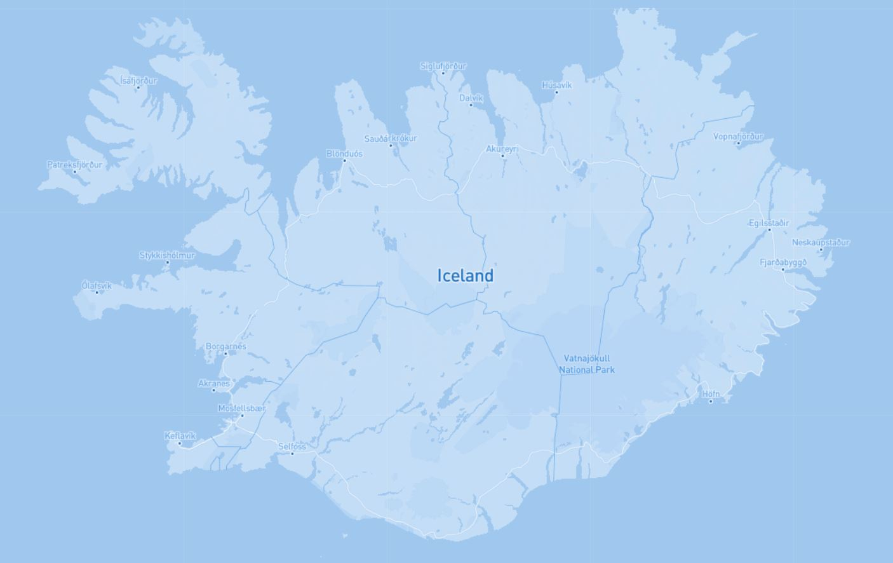

# Icy Iceland Tiles

## Introduction

This project was created to practice generating map tiles using QGIS open source software that can be used in leaflet web maps. Steps for this project can be found below.

>_This project was created for GEOG 458 (lab 4) with Bo Zhao at the University of Washington_

### View the [live map](https://kcroland.github.io/icy_iceland_tiles/) here :computer:

## Project Specifications

Map tiles for this geographic location (Iceland) were generated using the `QMetaTiles` plugin for QGIS the base parameters can be found in the official steps, but the following were specific to this map:

- **Zoom-**
  - **Minimum Zoom:** 5
  - **Maximum Zoom:** 10

These zoom levels allowed for great detail of the map to be viewed, however the increased detail significantly increased the amount of data that was generated from the tiles. This level of zoom detail limits the user to viewing Iceland with this specific map made in Mapbox.

>_The official steps for this project can be found on **[this page](https://github.com/jakobzhao/geog458/tree/master/labs/lab04)**_

#### Libraries and Other Attributions
- [Mapbox Studio](https://www.mapbox.com/) was used to create this very simple basemap to be used for the tiles.
- [QGIS](https://qgis.org/en/site/) was used to connect to the map on Mapbox and generate tiles for the webpage.
- `leaflet.js` was used to allow for quick deployment of a web map with interactivity.
- `jQuery` was used so for quicker development and better readability.
